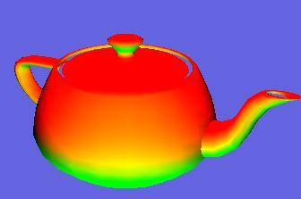



## SUPER HAPPY FUN DIRECTX8 TUTORIAL

### Description

It's a luvly new updated tutorial for doin equally nice 3D stuff in directX8!!

 

Featuring:  

*Verticies!!  

*Lighting!!  

*Matricies!! 

*Teapots!! umm..i mean Models!!  

*More Lighting!!  

*Texturing!!  

*Plenty commenting!!  

*No ants!!  

 

If u love this tutorial then tell the world! Comment your heart out! Comment if you hate it too so i can track you down and have words. Please note that it aint fully commented YET. Shall be soon though :D. Cheers to gamedev.net and Jack Hoxley for their directX stuff!!
 
### More Info
 

             |
---                |---
**Submitted On**   |2002-03-04 14:57:54
**By**             |[necromunda](https://github.com/Planet-Source-Code/PSCIndex/blob/master/ByAuthor/necromunda.md)
**Level**          |Intermediate
**User Rating**    |4.8 (19 globes from 4 users)
**Compatibility**  |VB 6\.0
**Category**       |[DirectX](https://github.com/Planet-Source-Code/PSCIndex/blob/master/ByCategory/directx__1-44.md)
**World**          |[Visual Basic](https://github.com/Planet-Source-Code/PSCIndex/blob/master/ByWorld/visual-basic.md)
**Archive File**   |[SUPER\_HAPP59301342002\.zip](https://github.com/Planet-Source-Code/necromunda-super-happy-fun-directx8-tutorial__1-32343/archive/master.zip)

